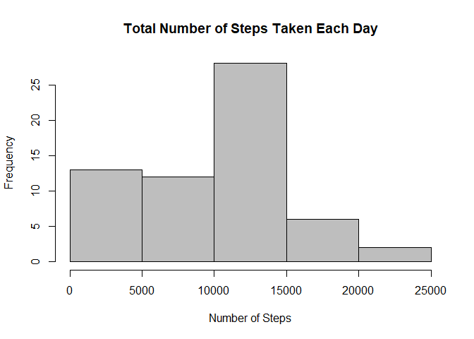
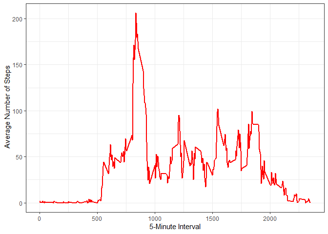
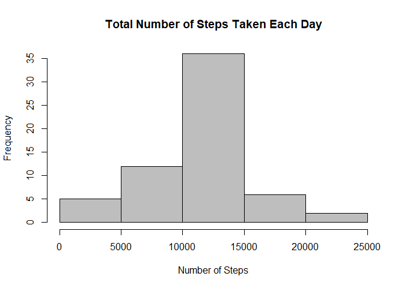
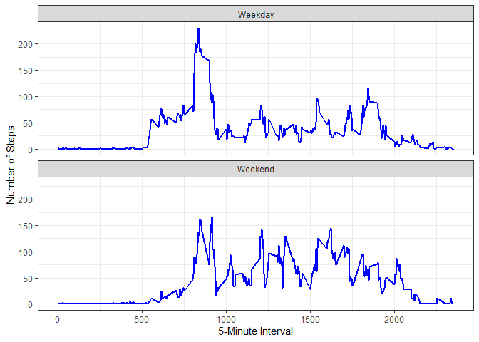

## Introduction

Devices such as Fitbit, Nike Fuelband, or Jawbone up has made possible to collect the large amount of data on personal movements. However, these data remained under-utilized  both because the raw data are hard to obtain and there is a lack of statistical methods and software for processing and interpreting the data.

Here, we will try to make use of data from personal activity monitoring device that collects data at 5 minutes intervals throughout the day. The data consists of two months of data from an anonymous individual collected during the months of October and November, 2012 and include the number of steps taken in 5 minute intervals each day.

The data for used here can be downloaded from the data set [Activity monitoring data](https://d396qusza40orc.cloudfront.net/repdata%2Fdata%2Factivity.zip).

The following variables are included in the data set:

- steps: Number of steps taking in a 5-minute interval
- date: The date on which the measurement was taken in YYYY-MM-DD format
- interval: Identifier for the 5-minute interval in which measurement was taken

The data set is stored in a comma-separated-value (CSV) file. The missing values are coded as <font color="red">NA</font>. There are a total of 17,568 observations in this data set.

Now, let's look at the data and answer some of the questions.

## Loading and preprocessing the data

To load the data into system memory and preprocess it, first lets download and open the required library. Here we will make the use of `data.table` and `ggplot` library.


```r
packages <- c("data.table", "dplyr","ggplot2")
installed_packages <- packages %in% rownames(installed.packages())
if (any(installed_packages == FALSE)) {
        install.packages(packages[!installed_packages])
}
invisible(lapply(packages, library, character.only = TRUE))
```

```
## 
## Attaching package: 'dplyr'
```

```
## The following objects are masked from 'package:data.table':
## 
##     between, first, last
```

```
## The following objects are masked from 'package:stats':
## 
##     filter, lag
```

```
## The following objects are masked from 'package:base':
## 
##     intersect, setdiff, setequal, union
```

The above code will install the library and load to memory in your system. If you have already installed these libraries, then it will only load these libraries in system memory.

Now use `getwd()` function to get the current working directory path to download the data.


```r
path <- getwd()

data_url <- "https://d396qusza40orc.cloudfront.net/repdata%2Fdata%2Factivity.zip"
download.file(data_url, "activity.zip")
unzip("activity.zip", exdir = "data")
```

The above code download the data from `data_url`, and then extracts the data from downloaded `zip` file to `data` directory in current working directory.

Now read the csv data from the data directory


```r
activity_data <- data.table::fread("data/activity.csv")
head(activity_data, 5)
```

```
##    steps       date interval
## 1:    NA 2012-10-01        0
## 2:    NA 2012-10-01        5
## 3:    NA 2012-10-01       10
## 4:    NA 2012-10-01       15
## 5:    NA 2012-10-01       20
```


```r
str(activity_data)
```

```
## Classes 'data.table' and 'data.frame':	17568 obs. of  3 variables:
##  $ steps   : int  NA NA NA NA NA NA NA NA NA NA ...
##  $ date    : IDate, format: "2012-10-01" "2012-10-01" ...
##  $ interval: int  0 5 10 15 20 25 30 35 40 45 ...
##  - attr(*, ".internal.selfref")=<externalptr>
```

## What is mean total number of steps taken per day?

#### 1. Let's calculate the mean total number of steps taken per day. We will ignore the missing data here.


```r
totalStep <- activity_data %>%
        group_by(date) %>%
        summarise(steps = sum(steps, na.rm = TRUE))
head(totalStep, 5)
```

```
## # A tibble: 5 × 2
##   date       steps
##   <IDate>    <int>
## 1 2012-10-01     0
## 2 2012-10-02   126
## 3 2012-10-03 11352
## 4 2012-10-04 12116
## 5 2012-10-05 13294
```

#### 2. Plot the histogram for number of steps per day.

Here we will use the base plot functions to plot the histogram for number of steps per day.


```r
hist(totalStep$steps,
     col = "grey",
     border = "black",
     xlab = "Number of Steps",
     ylab = "Frequency",
     main = "Total Number of Steps Taken Each Day")
```

<!-- -->

#### 3. What is the mean and median of number of steps taken per day?

We will use `mean` and `median` function to calculate the mean and median of above data.


```r
mean_steps <- mean(totalStep$steps)
cat("Mean steps per day:", mean_steps, "\n")
```

```
## Mean steps per day: 9354.23
```

```r
median_steps <- median(totalStep$steps)
cat("Median steps per day:", median_steps, "\n")
```

```
## Median steps per day: 10395
```

## What is the average daily activity pattern?

To understand the average daily activity pattern let's do the following:

#### 1. Make a time series plot of the average number of steps taken at 5-minute interval

For this we will use the `ggplot2` library. First lets calculate the average number of steps for each 5-minute interval across all days.


```r
avg_5mIntStep <- activity_data %>%
        group_by(interval) %>%
        summarise(steps = mean(steps, na.rm = TRUE))
head(avg_5mIntStep, 5)
```

```
## # A tibble: 5 × 2
##   interval  steps
##      <int>  <dbl>
## 1        0 1.72  
## 2        5 0.340 
## 3       10 0.132 
## 4       15 0.151 
## 5       20 0.0755
```

Now lets plot the above data.


```r
ggplot(data = avg_5mIntStep, aes(x = interval, y = steps)) +
        geom_line(color = "red", lwd = 1) +
        labs(x = "5-Minute Interval", y = " Average Number of Steps",
             main = "Time series of the average number of steps taken at 5-minute interval") +
        theme_bw()
```

<!-- -->


#### 2. Now let's calculate which 5-minute interval has maximum average number of steps.


```r
Interval <- avg_5mIntStep[which.max(avg_5mIntStep$steps), ]
Interval
```

```
## # A tibble: 1 × 2
##   interval steps
##      <int> <dbl>
## 1      835  206.
```

```r
cat("In interval", Interval$interval, "it contains the maximum average number of steps across all days and the average maximum number of steps is", Interval$steps)
```

```
## In interval 835 it contains the maximum average number of steps across all days and the average maximum number of steps is 206.1698
```


## Imputing missing values
In the original data there are missing values coded as <font color="red">NA</font>. Here we will deal with these missing values.

#### 1. First let's calculate the total number of missing values in the dataset.


```r
number_NA <- nrow(activity_data[is.na(steps), ])
number_NA
```

```
## [1] 2304
```

```r
cat("So we have total", number_NA , "number of rows with NA values.")
```

```
## So we have total 2304 number of rows with NA values.
```

#### 2. Now let's formulate the strategy how we fill the missing values in the dataset.

Here we will use the integer average value of each 5-minute interval to fill the missing values of those 5-minute interval. 


#### 3. Now let's fill the missing values in the dataset.

We now fill the missing values by above mentioned method and create new dataset that is equal to the original dataset but with the missing data filled in. For this, we have already calculated the average values for each interval in `avg_5mIntStep`. So we will use those average values to fill the missing values.


```r
new_filled_data <- activity_data %>%
        mutate(steps = ifelse(is.na(steps),
                              avg_5mIntStep$steps[match(interval, avg_5mIntStep$interval)],
                              steps))
head(new_filled_data, 5)
```

```
##        steps       date interval
## 1: 1.7169811 2012-10-01        0
## 2: 0.3396226 2012-10-01        5
## 3: 0.1320755 2012-10-01       10
## 4: 0.1509434 2012-10-01       15
## 5: 0.0754717 2012-10-01       20
```

In above code, `as.integer` keeps the integer values for the average number of steps if in decimal for filling missing values cases.


#### 4. Now let's analyze the total number of steps take each day for this newly created data.

First lets create the histogram for the newly created data for total number of steps taken each day. For this we will calculate the average as in first part.


```r
totalStep_newdata <- new_filled_data %>%
        group_by(date) %>%
        summarise(steps = sum(steps, na.rm = TRUE))
head(totalStep_newdata, 5)
```

```
## # A tibble: 5 × 2
##   date        steps
##   <IDate>     <dbl>
## 1 2012-10-01 10766.
## 2 2012-10-02   126 
## 3 2012-10-03 11352 
## 4 2012-10-04 12116 
## 5 2012-10-05 13294
```

Now we will make the histogram plot of the data.


```r
hist(totalStep_newdata$steps,
     col = "grey",
     border = "black",
     xlab = "Number of Steps",
     ylab = "Frequency",
     main = "Total Number of Steps Taken Each Day")
```

<!-- -->

Now let's calculate the mean and median for the total number of steps taken each day from above data.


```r
new_mean_steps <- mean(totalStep_newdata$steps)
cat("Mean steps per day after filling missing values:", new_mean_steps, "\n")
```

```
## Mean steps per day after filling missing values: 10766.19
```

```r
new_median_steps <- median(totalStep_newdata$steps)
cat("Median steps per day after filling missing values:", new_median_steps, "\n")
```

```
## Median steps per day after filling missing values: 10766.19
```

The mean and median for this dataset are equal, but differ from the original dataset. The mean  of this new dataset is higher compared to original dataset  that may have resulted from imputing the average data at each 5-minute interval wherever missing and the weightage of the imputed data.


## Are there differences in activity patterns between weekdays and weekends?

#### 1. Create weekday and weekend days variables.
To understand the weekdays pattern, we will use the `weekdays()` function to extract the weekdays. We will create the factor variables `weekday` and `weekend` to indicate whether the given date is weekday or weekend. We will use the newly created data `new_filled_data` here.

For this first lets create a function `week_day` that reads the date and changes it to weekday or weekend.


```r
week_day <- function(date){
        
        day <- weekdays(as.Date(date, '%Y-%m-%d'))
        if (day == "Saturday" | day == "Sunday"){
                weekday <- "Weekend"
        } else{
                weekday <- "Weekday"
        }
        weekday
}

new_filled_data$days <- as.factor(sapply(new_filled_data$date, week_day))
head(new_filled_data, 5)
```

```
##        steps       date interval    days
## 1: 1.7169811 2012-10-01        0 Weekday
## 2: 0.3396226 2012-10-01        5 Weekday
## 3: 0.1320755 2012-10-01       10 Weekday
## 4: 0.1509434 2012-10-01       15 Weekday
## 5: 0.0754717 2012-10-01       20 Weekday
```


#### 2. Panel plot of timeseries for weekday and weekend

Here we create a panel plot containing time series of average number of steps taken across all weekday or weekend days for 5 minute interval. For this first average the data based on weekday and weekend.


```r
avg_5mIntnewData <- new_filled_data %>%
        group_by(interval, days) %>%
        summarise(steps = mean(steps))
```

```
## `summarise()` has grouped output by 'interval'. You can override using the
## `.groups` argument.
```

```r
head(avg_5mIntnewData, 5)
```

```
## # A tibble: 5 × 3
## # Groups:   interval [3]
##   interval days     steps
##      <int> <fct>    <dbl>
## 1        0 Weekday 2.25  
## 2        0 Weekend 0.215 
## 3        5 Weekday 0.445 
## 4        5 Weekend 0.0425
## 5       10 Weekday 0.173
```


Now We will use the `ggplot` library, to plot the weekday and weekend data.


```r
ggplot(data = avg_5mIntnewData, aes(x = interval, y = steps)) +
        geom_line(color = "blue", lwd = 1) +
        facet_wrap(~days, nrow = 2) +
        labs(x = "5-Minute Interval", y = " Number of Steps") +
        theme_bw()
```

<!-- -->

